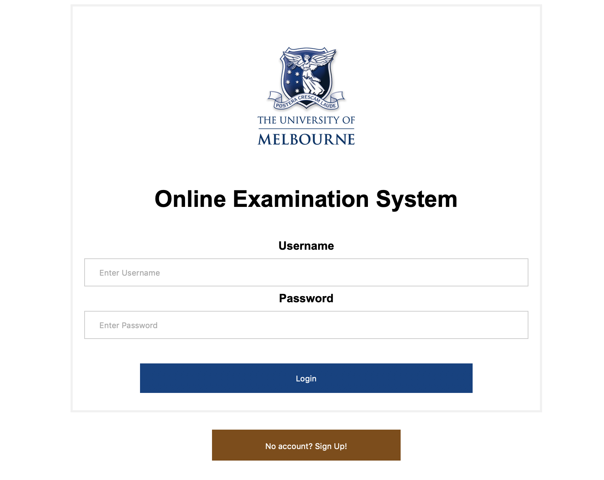
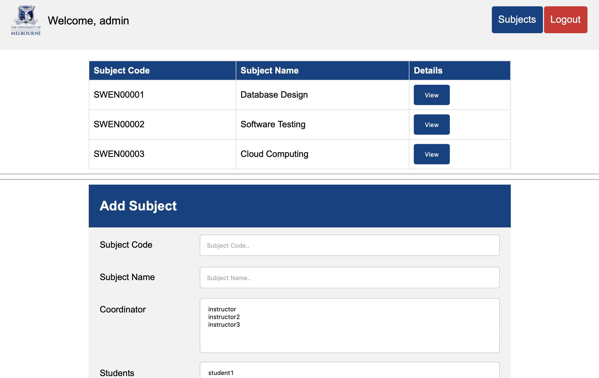
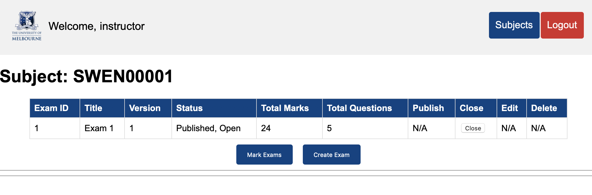
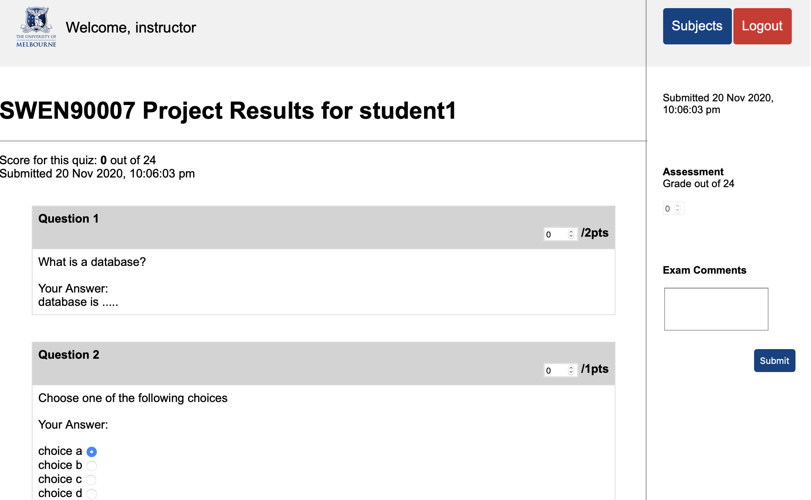
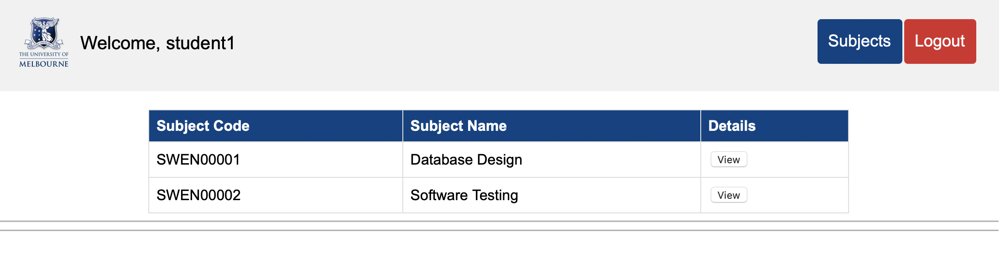
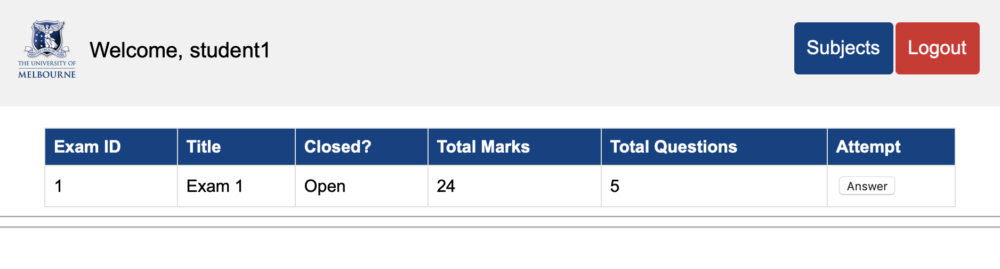
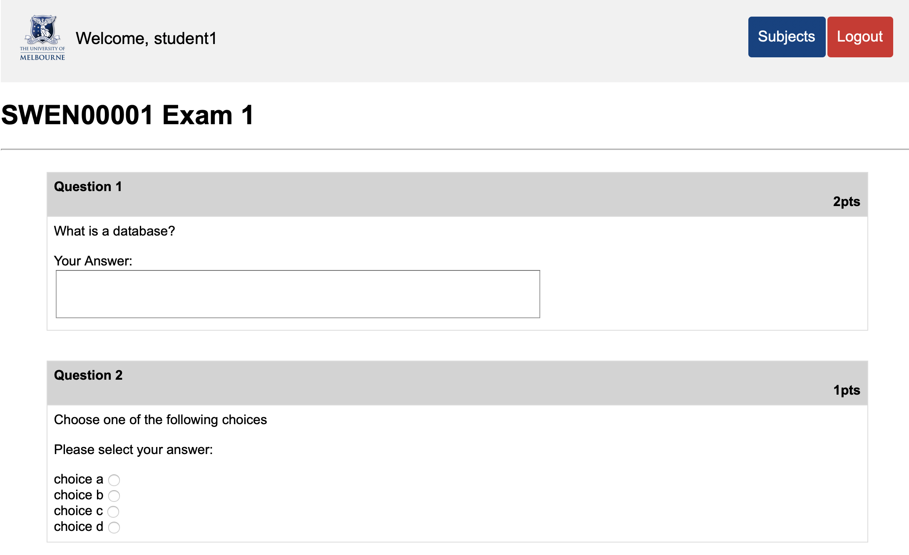

# Online-Exam-System
This repository shows a simple online examination application which uses Postgres as its database. Through the application, students can take exams created by subject instructors. Instructors can then use the application to mark exams and publish the results to students.

Some screenshots of the application is shown below.

Login Page:

Admin Subject Creation Page:

Exam List Page for Instructor:

Exam Marking Page for Instructor:

Subject List Page for Student:

Exam List Page for Student:

Exam Answering Page for Student:

